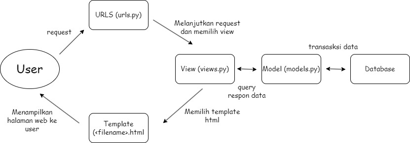

[link Aplikasi Heroku](https://tugas-pbp-django.herokuapp.com) 

**A. Buatlah bagan yang berisi request client ke web aplikasi berbasis Django beserta responnya dan jelaskan pada bagan tersebut kaitan antara urls.py, views.py, models.py, dan berkas html**

urls.py berfungsi untuk mengatur berbagai macam *routing* kemudian melanjutkan *request* ke *file* views.py. views.py menerima *request* dan mengambil data dari models.py yang berisi objek data, yang diidentifikasi oleh fungsi dan akan berinteraksi dengan database. Setelah itu, views.py memilih *template* berupa *file* html sesuai *request*. Kemudian views.py mengembalikan respon dalam bentuk html yang akan ditampilkan pada halaman *website*

**B. Jelaskan kenapa menggunakan *virtual environment*? Apakah kita tetap dapat membuat aplikasi web berbasis Django tanpa menggunakan *virtual environment*?**

Kita tetap dapat membuat aplikasi web berbasis Django tanpa menggunakan *virtual environment*. Tetapi tetap disarankan untuk menggunakan *virtual environment* karena *virtual environment* sangat berguna ketika kita membutuhkan *dependencies* yang berbeda-beda antara proyek satu dengan lainnya yang berjalan pada satu sistem operasi yang sama sehingga *dependencies* yang kita gunakan antara satu proyek dengan proyek lainnya tidak tercampur.

**C. Jelaskan bagaimana cara kamu mengimplementasikan poin 1 sampai dengan 4 di atas.**

1. Menambahkan fungsi show_katalog ke dalam views.py pada folder wishlist untuk menerima *request* yang akan diteruskan ke katalog.html, Kemudian membuat variabel data_barang_katalog untuk mengambil data dari model dan dikembalikan lagi kepada html.
2. Membuat sebuah routing di dalam urls.py untuk memetakan fungsi yang telah dibuat di views.py  dengan menambahkan app_name dan menambahkan path 
3. Menambahkan context pada file views.py berupa ‘list_katalog’ sebagai mapping ke dalam file katalog.html. kemudian pada file katalog.html ditambahkan for loop untuk menampilkan data katalognya
4. Membuat aplikasi baru pada heroku. kemudian masukkan API key dan nama aplikasi kedalam secret di github kemudian lakukan deploy

