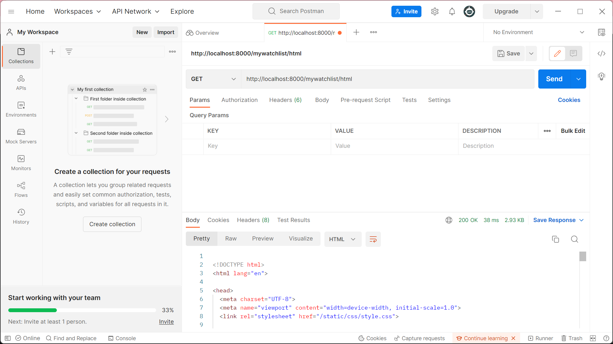
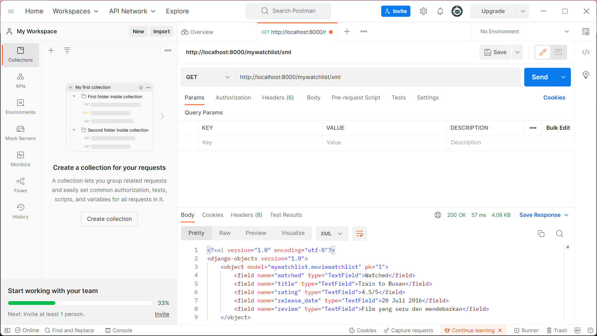
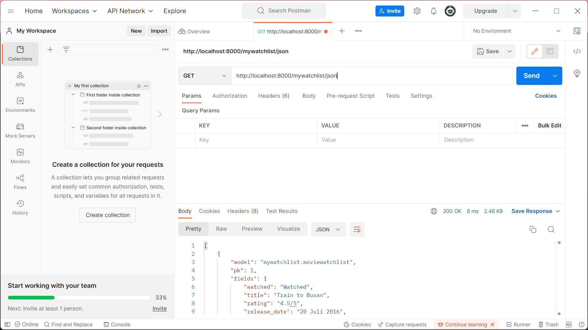

[Link Aplikasi Heroku](https://tugas-3-pbp.herokuapp.com/mywatchlist/)

**Jelaskan perbedaan antara JSON, XML, dan HTML!**

JSON: 

XML:

HTML: 

**Jelaskan mengapa kita memerlukan data delivery dalam pengimplementasian sebuah platform?**

**Jelaskan bagaimana cara kamu mengimplementasikan checklist di atas.**

**SCREENSHOT POSTMAN**

http://localhost:8000/mywatchlist/html

http://localhost:8000/mywatchlist/xml

http://localhost:8000/mywatchlist/json
